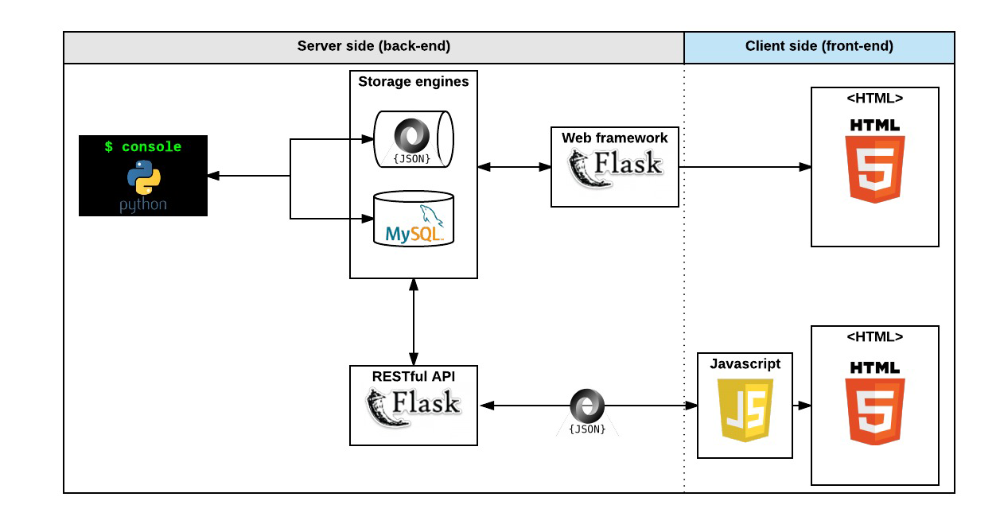

<div align="center">
<br>


</div>


<p align="center">


</p>


<h1 align="center"> AirBnB clone - Web dynamic </h1>


<h3 align="center">
<a href="https://github.com/RazikaBengana/holbertonschool-AirBnB_clone_v4/tree/main/web_dynamic#eye-about">About</a> •
<a href="https://github.com/RazikaBengana/holbertonschool-AirBnB_clone_v4/tree/main/web_dynamic#hammer_and_wrench-tasks">Tasks</a> •
<a href="https://github.com/RazikaBengana/holbertonschool-AirBnB_clone_v4/tree/main/web_dynamic#memo-learning-objectives">Learning Objectives</a> •
<a href="https://github.com/RazikaBengana/holbertonschool-AirBnB_clone_v4/tree/main/web_dynamic#computer-requirements">Requirements</a> •
<a href="https://github.com/RazikaBengana/holbertonschool-AirBnB_clone_v4/tree/main/web_dynamic#keyboard-more-info">More Info</a> •
<a href="https://github.com/RazikaBengana/holbertonschool-AirBnB_clone_v4/tree/main/web_dynamic#mag_right-resources">Resources</a> •
<a href="https://github.com/RazikaBengana/holbertonschool-AirBnB_clone_v4/tree/main/web_dynamic#bust_in_silhouette-authors">Authors</a> •
<a href="https://github.com/RazikaBengana/holbertonschool-AirBnB_clone_v4/tree/main/web_dynamic#octocat-license">License</a>
</h3>

---

<!-- ------------------------------------------------------------------------------------------------- -->

<br>
<br>

## :eye: About

<br>

<div align="center">

**`AirBnB clone - web dynamic`** project focuses on creating an interactive Flask-based web application that **simulates the core functionality of the AirBnB platform**.
<br>
<br>
The project, contained within this `web_dynamic` folder, combines `Python` backend scripts for routing and data management with `HTML` templates enhanced by `JavaScript` and `CSS`, enabling users to dynamically search, filter, and view rental properties without full page reloads.
<br>
<br>
Leveraging `Jinja2` templating, the application renders property information, amenities, and user reviews in real-time, providing a **responsive and efficient user interface that closely mimics the experience of browsing the actual AirBnB website**.
<br>
<br>
This project has been created by **[Holberton School](https://www.holbertonschool.com/about-holberton)** to enable every student to understand how to build a fully functional web application.
<br>
<br>
Through hands-on development of core components, we gain practical experience in backend systems, data modeling, software architecture, and front-end web development skills.

</div>

<br>
<br>

<!-- ------------------------------------------------------------------------------------------------- -->

## :hammer_and_wrench: Tasks

<br>

**`0. Last clone!`**

**`1. Cash only`**

**`2. Select some Amenities to be comfortable!`**

**`3. API status`**

**`4. Fetch places`**

**`5. Filter places by Amenity`**

**`6. States and Cities`**

**`7. Reviews`**

<br>
<br>

<!-- ------------------------------------------------------------------------------------------------- -->

## :memo: Learning objectives

<br>

**_You are expected to be able to [explain to anyone](https://fs.blog/feynman-learning-technique/), without the help of Google:_**

<br>

```diff

General

+ How cool it is to request your own API

+ How to modify an HTML element style

+ How to get and update an HTML element content

+ How to modify the DOM

+ How to make a GET request with JQuery Ajax

+ How to make a POST request with JQuery Ajax

+ How to listen/bind to DOM events

+ How to listen/bind to user events

```

<br>
<br>

<!-- ------------------------------------------------------------------------------------------------- -->

## :computer: Requirements

<br>

```diff

General

+ Allowed editors: vi, vim, emacs

+ All your files will be interpreted on Chrome (version 57.0)

+ All your files should end with a new line

+ A README.md file, at the root of the folder of the project, is mandatory

+ Your code should be semistandard compliant with the flag --global $: semistandard *.js --global $

+ All your JavaScript must be in the folder scripts

+ You must use JQuery version 3.x

- You are not allowed to use var

- HTML should not reload for each action: DOM manipulation, update values, fetch data…

```

<br>

**_Why all your files should end with a new line? See [HERE](https://unix.stackexchange.com/questions/18743/whats-the-point-in-adding-a-new-line-to-the-end-of-a-file/18789)_**

<br>
<br>

### GitHub

<br>

There should be one project repository per group. <br>
If you clone/fork/whatever a project repository with the same name before the second deadline, you risk a 0% score.

<br>
<br>

<!-- ------------------------------------------------------------------------------------------------- -->

## :keyboard: More Info

<br>

### Import `JQuery`:

<br>

```yaml
<head>
    <script src="https://code.jquery.com/jquery-3.2.1.min.js"></script>
</head>
```

<br>
<br>

### Before starting the project…

<br>

- You will work on a codebase using [Flasgger](https://github.com/flasgger/flasgger), you will need to install it locally first before starting the `RestAPI`:

<br>

```yaml
$ sudo apt-get install -y python3-lxml
$ sudo pip3 install flask_cors # if it was not installed yet
$ sudo pip3 install flasgger
```

<br>

- If the `RestAPI` is not starting, please read the error message.

  - Based on the(ses) error message(s), you will have to troubleshoot potential dependencies issues.

<br>

#### :bulb: Here some solutions:

<br>
<br>

- `jsonschema` exception:

<br>

```yaml
$ sudo pip3 uninstall -y jsonschema 
$ sudo pip3 install jsonschema==3.0.1
```

<br>
<br>

- `No module named 'pathlib2'`:

<br>

```yaml
$ sudo pip3 install pathlib2
```

<br>
<br>

### Expose ports from your `Vagrant`:

<br>

- In your `Vagrantfile`, add this line for each port forwarded:

<br>

```
# I expose the port 5001 of my vm to the port 5001 on my computer
config.vm.network :forwarded_port, guest: 5001, host: 5001 
```

<br>

- if you need to expose other ports, same line but you will need to replace the “**guest port**” (inside your `vagrant`) and your “**host port**” (outside your `vagrant`, used from your browser for example).

- It’s important in your project, to use the AirBnB `API` with the port `5001`

<br>
<br>
<br>
<br>



<br>
<br>

<!-- ------------------------------------------------------------------------------------------------- -->

## :mag_right: Resources

<br>

**_Do you need some help?_**

<br>

**Concepts:**

* [AirBnB clone](https://drive.google.com/file/d/1-awCeRNF0tjxzzKWqxAohHlxN3guYq5b/view?usp=sharing)

<br>

**Read or watch:**

* [Selector](https://jquery-tutorial.net/selectors/using-elements-ids-and-classes/)

* [Get and set content](https://jquery-tutorial.net/dom-manipulation/getting-and-setting-content/)

* [Manipulate CSS classes](https://jquery-tutorial.net/dom-manipulation/getting-and-setting-css-classes/)

* [Manipulate DOM elements](https://jquery-tutorial.net/dom-manipulation/the-append-and-prepend-methods/)

* [Document ready](https://learn.jquery.com/using-jquery-core/document-ready/)

* [Introduction](https://jquery-tutorial.net/ajax/introduction/)

* [GET & POST request](https://jquery-tutorial.net/ajax/the-get-and-post-methods/)

* [HTTP access control (CORS)](https://developer.mozilla.org/en-US/docs/Web/HTTP/CORS)

<br>
<br>

<!-- ------------------------------------------------------------------------------------------------- -->

## :bust_in_silhouette: Authors

<br>

**${\color{blue}Razika \space Bengana}$**

<br>
<br>

<!-- ------------------------------------------------------------------------------------------------- -->

## :octocat: License

<br>

```AirBnB clone - web dynamic``` _project has no license specified._

<br>
<br>

---

<p align="center"><br>2022</p>