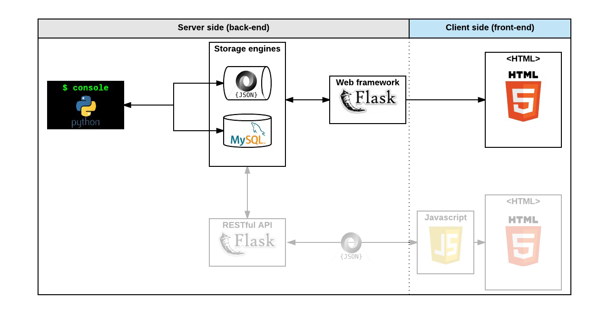

<div align="center">
<br>


</div>


<p align="center">


</p>


<h1 align="center"> AirBnB clone - Web framework </h1>


<h3 align="center">
<a href="https://github.com/RazikaBengana/holbertonschool-AirBnB_clone_v3/tree/main/web_flask#eye-about">About</a> •
<a href="https://github.com/RazikaBengana/holbertonschool-AirBnB_clone_v3/tree/main/web_flask#hammer_and_wrench-tasks">Tasks</a> •
<a href="https://github.com/RazikaBengana/holbertonschool-AirBnB_clone_v3/tree/main/web_flask#memo-learning-objectives">Learning Objectives</a> •
<a href="https://github.com/RazikaBengana/holbertonschool-AirBnB_clone_v3/tree/main/web_flask#computer-requirements">Requirements</a> •
<a href="https://github.com/RazikaBengana/holbertonschool-AirBnB_clone_v3/tree/main/web_flask#keyboard-more-info">More Info</a> •
<a href="https://github.com/RazikaBengana/holbertonschool-AirBnB_clone_v3/tree/main/web_flask#mag_right-resources">Resources</a> •
<a href="https://github.com/RazikaBengana/holbertonschool-AirBnB_clone_v3/tree/main/web_flask#bust_in_silhouette-authors">Authors</a> •
<a href="https://github.com/RazikaBengana/holbertonschool-AirBnB_clone_v3/tree/main/web_flask#octocat-license">License</a>
</h3>

---

<!-- ------------------------------------------------------------------------------------------------- -->

<br>
<br>

## :eye: About

<br>

<div align="center">

**`AirBnB clone - web framework`** project implements the web application based on `Flask`, serving as an **interface between users and backend data models**.
<br>
<br>
It contains `Python` scripts in this `web_flask` directory that define routes and views, a `web_flask/templates` subfolder with `HTML` files for rendering dynamic content, and a `web_flask/static` subfolder hosting `CSS` files and images for styling and visual enhancement.
<br>
Together, these components enable to provide a fully functional, visually appealing, and interactive web interface for the AirBnB clone features, facilitating dynamic page rendering and efficient handling of HTTP requests via a web browser.
<br>
<br>
This project has been created by **[Holberton School](https://www.holbertonschool.com/about-holberton)** to enable every student to understand how to build a fully functional web application.
<br>
<br>
Through hands-on development of core components, we gain practical experience in backend systems, data modeling, software architecture, and front-end web development skills.

</div>

<br>
<br>

<!-- ------------------------------------------------------------------------------------------------- -->

## :hammer_and_wrench: Tasks

<br>

**`0. Hello Flask!`**

**`1. HBNB`**

**`2. C is fun!`**

**`3. Python is cool!`**

**`4. Is it a number?`**

**`5. Number template`**

**`6. Odd or even?`**

**`7. Improve engines`**

**`8. List of states`**

**`9. Cities by states`**

**`10. States and State`**

**`11. HBNB filters`**

**`12. HBNB is alive!`**

<br>
<br>

<!-- ------------------------------------------------------------------------------------------------- -->

## :memo: Learning objectives

<br>

**_You are expected to be able to [explain to anyone](https://fs.blog/feynman-learning-technique/), without the help of Google:_**

<br>

```diff

General

+ What is a Web Framework

+ How to build a web framework with Flask

+ How to define routes in Flask

+ What is a route

+ How to handle variables in a route

+ What is a template

+ How to create a HTML response in Flask by using a template

+ How to create a dynamic template (loops, conditions…)

+ How to display in HTML data from a MySQL database

```

<br>
<br>

<!-- ------------------------------------------------------------------------------------------------- -->

## :computer: Requirements

<br>

```diff

Python Scripts

+ Allowed editors: vi, vim, emacs

+ All your files will be interpreted/compiled on Ubuntu 20.04 LTS using python3 (version 3.8.5)

+ All your files should end with a new line

+ The first line of all your files should be exactly #!/usr/bin/python3

+ A README.md file, at the root of the folder of the project, is mandatory

+ Your code should use the pycodestyle (version 2.7.*)

+ All your files must be executable

+ The length of your files will be tested using wc

+ All your modules should have documentation (python3 -c 'print(__import__("my_module").__doc__)')

+ All your classes should have documentation (python3 -c 'print(__import__("my_module").MyClass.__doc__)')

+ All your functions (inside and outside a class) should have documentation (python3 -c 'print(__import__("my_module").my_function.__doc__)' and python3 -c 'print(__import__("my_module").MyClass.my_function.__doc__)')

+ A documentation is not a simple word, it’s a real sentence explaining what’s the purpose of the module, class or method (the length of it will be verified)


HTML/CSS Files

+ Allowed editors: vi, vim, emacs

+ All your files should end with a new line

+ A README.md file at the root of the folder of the project is mandatory

+ Your code should be W3C compliant and validate with W3C-Validator (except for jinja template)

+ All your CSS files should be in the styles folder

+ All your images should be in the images folder

- You are not allowed to use !important or id (#... in the CSS file)

+ All tags must be in uppercase

+ Current screenshots have been done on Chrome 56.0.2924.87.

- No cross browsers

```

<br>

**_Why all your files should end with a new line? See [HERE](https://unix.stackexchange.com/questions/18743/whats-the-point-in-adding-a-new-line-to-the-end-of-a-file/18789)_**

<br>
<br>

<!-- ------------------------------------------------------------------------------------------------- -->

## :keyboard: More Info

<br>

### `MySQL` Default charset issues:

<br>

- If you get Flask errors after executing the `curl ...` commands, it might be because of the `DEFAULT CHARSET`. <br>

- If it’s `DEFAULT CHARSET=latam1`, you might want to change it to `DEFAULT CHARSET=utf8mb4`:

  - either on the server’s config file (`/etc/mysql/my.cnf commonly`)
  - or on the `CREATE DATABASE` statement.

<br>
<br>

### Install `Flask`:

<br>

```
$ pip3 install Flask
```

<br>
<br>



<br>
<br>

### Python `Flask` web framework:

<br>

[](https://www.youtube.com/watch?v=lzs4nQOiZQY)

<br>
<br>

:pushpin: **Note**:
<br>
<br>
Try setting FLASK configuration `debug` to `False` iIf you get the following error when running the checker:

<br>

```
- [Got]
rpc error: code = 2 desc = oci runtime error: exec failed: container_linux.go:290: starting container process caused "process_linux.go:111: decoding init error from pipe caused \"read parent: connection reset by peer\""


(222 chars long)
```

<br>
<br>

<!-- ------------------------------------------------------------------------------------------------- -->

## :mag_right: Resources

<br>

**_Do you need some help?_**

<br>

**Concepts:**

* [AirBnB clone](https://drive.google.com/file/d/102r3t7QiSiabjUrlI-XzD0rAvTc-Efu1/view?usp=sharing)

<br>

**Read or watch:**

* [What is a Web Framework?](https://intelegain-technologies.medium.com/what-are-web-frameworks-and-why-you-need-them-c4e8806bd0fb)

* [A Minimal Application](https://flask.palletsprojects.com/en/2.2.x/quickstart/#a-minimal-application)

* [Routing](https://flask.palletsprojects.com/en/2.2.x/quickstart/#routing)

* [Rendering Templates](https://flask.palletsprojects.com/en/2.2.x/quickstart/#rendering-templates)

* [Synopsis](https://jinja.palletsprojects.com/en/3.0.x/templates/#synopsis)

* [Variables](https://jinja.palletsprojects.com/en/3.0.x/templates/#variables)

* [Comments](https://jinja.palletsprojects.com/en/3.0.x/templates/#comments)

* [Whitespace Control](https://jinja.palletsprojects.com/en/3.0.x/templates/#whitespace-control)

* [List of Control Structures](https://jinja.palletsprojects.com/en/3.0.x/templates/#list-of-control-structures)

* [Flask](https://palletsprojects.com/p/flask/)

* [Jinja](https://jinja.palletsprojects.com/en/3.0.x/templates/)

<br>
<br>

<!-- ------------------------------------------------------------------------------------------------- -->

## :bust_in_silhouette: Authors

<br>

**${\color{blue}Razika \space Bengana}$**

<br>
<br>

<!-- ------------------------------------------------------------------------------------------------- -->

## :octocat: License

<br>

```AirBnB clone - web framework``` _project has no license specified._

<br>
<br>

---

<p align="center"><br>2022</p>