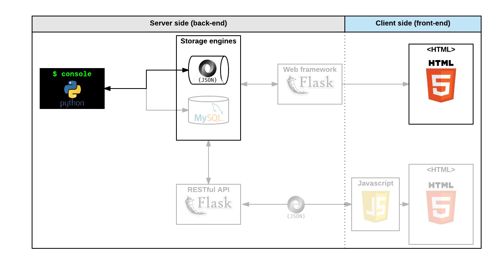

<div align="center">
<br>


</div>


<p align="center">


</p>


<h1 align="center"> AirBnB clone - Web static </h1>


<h3 align="center">
<a href="https://github.com/RazikaBengana/holbertonschool-AirBnB_clone_v3/tree/main/web_static#eye-about">About</a> •
<a href="https://github.com/RazikaBengana/holbertonschool-AirBnB_clone_v3/tree/main/web_static#hammer_and_wrench-tasks">Tasks</a> •
<a href="https://github.com/RazikaBengana/holbertonschool-AirBnB_clone_v3/tree/main/web_static#memo-learning-objectives">Learning Objectives</a> •
<a href="https://github.com/RazikaBengana/holbertonschool-AirBnB_clone_v3/tree/main/web_static#computer-requirements">Requirements</a> •
<a href="https://github.com/RazikaBengana/holbertonschool-AirBnB_clone_v3/tree/main/web_static#keyboard-more-info">More Info</a> •
<a href="https://github.com/RazikaBengana/holbertonschool-AirBnB_clone_v3/tree/main/web_static#mag_right-resources">Resources</a> •
<a href="https://github.com/RazikaBengana/holbertonschool-AirBnB_clone_v3/tree/main/web_static#bust_in_silhouette-authors">Authors</a> •
<a href="https://github.com/RazikaBengana/holbertonschool-AirBnB_clone_v3/tree/main/web_static#octocat-license">License</a>
</h3>

---

<!-- ------------------------------------------------------------------------------------------------- -->

<br>
<br>

## :eye: About

<br>

<div align="center">

**`AirBnB clone - web static`** project focuses on creating the **front-end structure** and styling of the simplified AirBnB clone website.
<br>
<br>
The `HTML` files in the `/web_static` directory define the basic layout and content of the web pages, including headers, footers, filters, and place listings.
<br>
The `CSS` files in the `/web_static/styles` folder provide the visual styling and layout for these elements, while the `/web_static/images` directory contains the visual assets used throughout the site, creating a cohesive and visually appealing user interface.
<br>
<br>
This project has been created by **[Holberton School](https://www.holbertonschool.com/about-holberton)** to enable every student to understand how to build a fully functional web application.
<br>
<br>
Through hands-on development of core components, we gain practical experience in backend systems, data modeling, software architecture, and front-end web development skills.

</div>

<br>
<br>

### Background Context

<br>

### **_Web static, what?_**

<br>
<br>

Now that you have a command interpreter for managing your AirBnB objects, it’s time to make them alive!
<br>
Before developing a big and complex web application, we will build the front end step-by-step.

<br>
<br>

- The first step is to “design” / “sketch” / “prototype” each element:

  - Create simple `HTML` static pages
  - Style guide
  - Fake contents
  - No `Javascript`
  - No data loaded from anything

<br>
<br>

- During this project, you will learn how to manipulate `HTML` and `CSS` languages:

  - `HTML` is the structure of your page, it should be the first thing to write.
  - `CSS` is the styling of your page, the design.

<br>

I really encourage you to fix your `HTML` part before starting the styling. <br>
Indeed, without any structure, you can’t apply any design.

<br>
<br>

Before starting, please fork or clone the repository `AirBnB_clone` from your partner if you were not the owner of the previous project.

<br>
<br>

<!-- ------------------------------------------------------------------------------------------------- -->

## :hammer_and_wrench: Tasks

<br>

**`0. Inline styling`**

**`1. Head styling`**

**`2. CSS files`**

**`3. Zoning done!`**

**`4. Search!`**

**`5. More filters`**

**`6. It's (h)over`**

**`7. Display results`**

**`8. More details`**

**`9. Full details`**

**`10. Flex`**

**`11. Responsive design`**

**`12. Accessibility`**

<br>
<br>

<!-- ------------------------------------------------------------------------------------------------- -->

## :memo: Learning objectives

<br>

**_You are expected to be able to [explain to anyone](https://fs.blog/feynman-learning-technique/), without the help of Google:_**

<br>

```diff

General

+ What is HTML

+ How to create an HTML page

+ What is a markup language

+ What is the DOM

+ What is an element / tag

+ What is an attribute

+ How does the browser load a webpage

+ What is CSS

+ How to add style to an element

+ What is a class

+ What is a selector

+ How to compute CSS Specificity Value

+ What are Box properties in CSS

```

<br>
<br>

<!-- ------------------------------------------------------------------------------------------------- -->

## :computer: Requirements

<br>

```diff

General

+ Allowed editors: vi, vim, emacs

+ All your files should end with a new line

+ A README.md file, at the root of the folder of the project, is mandatory

+ Your code should be W3C compliant and validate with W3C-Validator

+ All your CSS files should be in styles folder

+ All your images should be in images folder

- You are not allowed to use !important and id (#... in the CSS file)

- You are not allowed to use tags img, embed and iframe

- You are not allowed to use Javascript

+ Current screenshots have been done on Chrome 56 or more.

- No cross browsers

+ You have to follow all requirements but some margin/padding are missing - you should try to fit as much as you can to screenshots

```

<br>

- [W3C-Validator](https://github.com/hs-hq/W3C-Validator)

<br>

**_Why all your files should end with a new line? See [HERE](https://unix.stackexchange.com/questions/18743/whats-the-point-in-adding-a-new-line-to-the-end-of-a-file/18789)_**

<br>
<br>

<!-- ------------------------------------------------------------------------------------------------- -->

## :keyboard: More Info

<br>
<br>



<br>
<br>

<!-- ------------------------------------------------------------------------------------------------- -->

## :mag_right: Resources

<br>

**_Do you need some help?_**

<br>

**Read or watch:**

* [Learn to Code HTML & CSS](https://learn.shayhowe.com/html-css/)

* [Inline Styles in HTML](https://www.codecademy.com/article/html-inline-styles)

* [Specifics on CSS Specificity](https://css-tricks.com/specifics-on-css-specificity/)

* [CSS SpeciFishity](https://www.standardista.com/cgi-sys/suspendedpage.cgi)

* [Introduction to HTML](https://developer.mozilla.org/en-US/docs/Learn/HTML/Introduction_to_HTML)

* [CSS](https://developer.mozilla.org/en-US/docs/Learn/CSS)

* [MDN](https://developer.mozilla.org/en-US/)

* [center boxes](https://css-tricks.com/centering-css-complete-guide/)

<br>
<br>

<!-- ------------------------------------------------------------------------------------------------- -->

## :bust_in_silhouette: Authors

<br>

**${\color{blue}Razika \space Bengana}$**

<br>
<br>

<!-- ------------------------------------------------------------------------------------------------- -->

## :octocat: License

<br>

```AirBnB clone - web static``` _project has no license specified._

<br>
<br>

---

<p align="center"><br>2022</p>